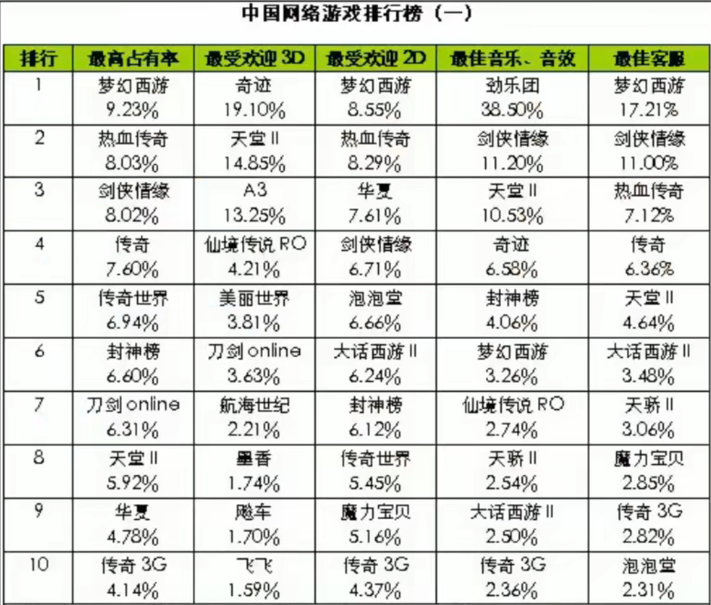

## 经济大数
世界人口:  69亿
中国人口:  14亿
中国GDP占比: 16%
中国人口占比: 20%

总面积:  454万平方公里, 
总人口:  6.5亿, 8.5%
GDP: \$90000亿或\$30000亿, 人民币63万亿或21万亿. 中国GDP100万亿
人均GDP:  $5000

中国大省10万亿, 北京上海3万多亿
300多个地级市, 600多个县级地级市

- 干嘉伟 美团COO
- 险峰长青（原险峰华兴）包凡
- 58姚劲波 赶集网杨浩涌瓜子二手车 58是100亿美元量级
- 滴滴程维柳青快的吕传伟uber柳甄
- 美团王兴王慧文点评张涛
- 携程梁建章去哪儿庄辰超
- GGV 纪源资本 童士豪 符绩勋
- 红杉沈南鹏
- 经纬 张颖 邵亦波 (易趣)
- 高瓴 张磊
- 饿了么 张旭豪
- Keep王宁（90年）、快看漫画陈安妮（92年）、霸蛮张天一（90年）、喜茶聂云宸（91年）
- 字节多个明星产品负责人都是90后，包括西瓜视频张楠、火山韩尚佑、皮皮虾张心皓等；此外美团有榛果民宿CEO冯威赫
- 快递 - 广东顺德, 四通一达
- papi 姜逸磊
- 金星 新氧
- 潘乱 - 虎嗅
- 老编辑张豫宏 - 36Kr, 新浪
- 宋玮 小晚
- 木村拓周（周佳阳)
- 池建强 mactalk 锤子 极客绑 洪恩软件 用友
- 金字节 头条
- 北极光 邓峰
- Tim Gong 龚挺 SIG
- 唐骏, 本科毕业于北京邮电大学，后前往日本名古屋大学深造并取得工学硕士学位。1994年加入微软公司美国总部，先后担任微软全球技术中心总经理，微软中国公司总裁. 盛大. 假装caltech, 实际Pacific Western University野鸡大学买的, 专门卖学位
- (凯鹏华盈ccv) 万咖壹联 土巴兔 硬核联盟 渠道SDK 应用分发 OPPO、vivo、酷派、金立、联想、华为、魅族、 努比亚 2014年8月1日

临江仙·滚滚长江东逝水 【作者】杨慎 【朝代】明 古今多少事，都付笑谈中。

林军的沸腾十五年遣词造句水平太差, 比不上激荡三十年或大败局, 更没法跟刘韧的书比. 只有八卦

前世不修, 生在徽州. 十三四岁, 往外一丢

Brandon Wade (Lead Wey) HCI, MIT, sugardaddy.com

Reid Hoffman
Sam Altman
Paul Graham
Brian Chesky Airbnb

- 直播, 默认倍数是30x
- 郭威不是新加坡上的大学. 是新加坡上了IB. 毕业就办了一个Weis Fund, Guo Wei's Fund呗.. OnePiece一个fund + 创业服务孵化器类组织
- 张悦然，山东济南人，中国80后女作家。毕业于新加坡国立大学计算机专业。省实验. 《葵花走失在1890》、《张悦然十爱》 `SM2`
- 刘韧是 1996 年加入《中国计算机报》的。一年多，写了 50 个互联网创业者，然后出版了《知识英雄》。2001 年刘韧跳槽去《电脑报》做一个新项目，差点把当时在《中国企业家》的牛文文一块带了去。刘韧后来发现了 Keso、张栋伟，Keso 发现王乐、冯大刚、宋保强，使命感便一代一代的传了下去。要不是周鸿祎那件事情，这帮人可能会写出互联网上最好看的故事。
- 2019, 喜马拉雅估值240亿人民币
- 蔡文胜: 域名, 个人站之王, 美图, 4399,   福建泉州石狮
- 策源冯波, 哥哥联创冯涛. 老婆是邓小平外孙女, 岳父是贺平
- 凡客, 后来再也没听到了. 陈年反思给贵人看. 能上市不上. 定下100亿GMV目标没法执行
- 陈大年和陈天桥的盛大创新院, 没出别的东西, 只有自己弟弟的wifi万能钥匙成了. 掌门科技下面的连尚网络. 这兄弟俩, 确实不用再跟人聊首富不首富的. 不过连尚网络来新加坡来得很晚
- 王志东, 东莞人, 北大无线电. 中文之星 (外挂中文win), 四通利方, 新浪
- 曹国伟作为高管加入, CFO, 最后出资买股权掌控新浪
- Kevin Kelly, Out of Control

- 董明珠是南京人, 老公死了之后过了6年, 这日子太烦了, 还欠外债, 扔下儿子东东让爷爷辈管, 自己出来打工. 毕竟明珠!

OpenWRT -> Wireless RouTer

