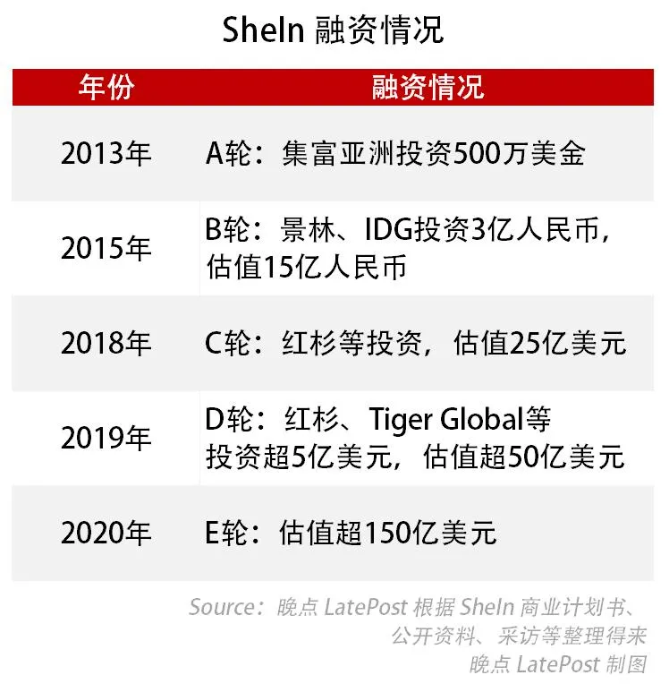
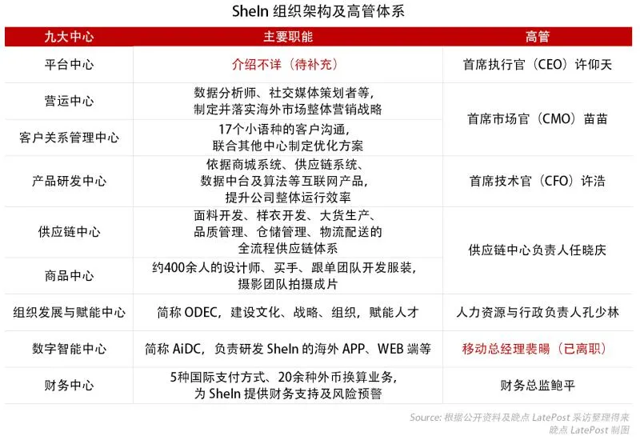

# title
揭秘 SheIn：中国最神秘百亿美元公司的崛起

# author
晚点团队

# publisher
晚点LatePost

# date
2020-08

# chapter
列传

# tag
消费, 跨境电商

# remarks
`了不起的公司, 也是了不起的稿子. 都算上十二年`

`海外下沉人民的中产阶级梦想`

`中国人对各种种草套路已经产生了一定的免疫，而对外国朋友来说一切都是这么的新鲜！`

那会儿 SheIn 的规模还很小。2013 年 1 月，完婚次日，创始人许仰天在 Facebook 用英文写道，“我的公司发展迅速，我现在已经有超过 50 个员工了！”

“SheIn 前身最早是我参与创立的，但后来许仰天把我和另外一个创始人王小虎踢出局了。”李鹏对《晚点 LatePost》表示。

许仰天是一个善于把握机会，为了目标可以付出巨大牺牲的人，他不愿意给供应商拖延一天账期，却会在没有告知合伙人前提下就直接带团队离开公司。

李鹏说，他当年和许仰天聊天时谈到，08 年金融危机让他意识到中产阶级会崩溃，所以要给他们提供便宜的衣服。不止是他俩，很多人都看到了这个机会。但 12 年过去，跨境电商的赢家，是许仰天。

---

SheIn 成立于 2008 年 10 月，金融危机那一年。当时公司名为南京点唯信息技术有限公司。根据工商信息，创始人许仰天持股 45% 的股份，他还有两位合伙人，王小虎、李鹏各占 45%、10% 的股份。

许仰天做 SEO（搜索引擎优化）起家。一位许仰天的早期合作伙伴表示，创立南京点唯之前，许仰天是南京奥道公司（做外贸线上营销）的员工。许仰天的 SEO 团队在外面接活，把赚来的钱投入到点唯公司。

 “挂羊头卖狗肉，卖一些仿货。这是必要的原始积累。”许仰天的一位早期合作伙伴表示。

当时还没有 SheIn 这个名字，网站用过很多域名，将 fashion（时尚）、outlets（折扣）、online shopping（在线购物）、she、her 之类的关键词，比如 do-a-fashion.com。点唯公司用很多手段刷网站在 Google 的搜索关键词排名，被处理后就换个域名继续刷。

李鹏对许仰天的印象是 “极致”。当初做 SEO 的时候，许动辄测试上万个客户，“一天到晚测试”。李鹏放手让下面的营销总监去干的活，许仰天会亲自做。

一般人投广告做到一定程度就可以了，但许仰天 “骨头缝里的都吃掉，营销成本控制得比同行便宜 70% 以上。”

李鹏还记得第一次见许仰天的时候，“精瘦得跟猴一样 “。那时候培训完了，许仰天拉上他一起吃饭，谈到自己穷苦的出生。小时候 “馒头泡酱油”，高三就在外面打工，大学也是半工半读。“有些人是被迫勤奋”，而他印象中，许仰天从不会偷懒，没有过多的娱乐活动，也几乎没有在十一点前回过家。李鹏说，他自己的性格则与许仰天正相反。

点唯公司只经营了不到一年。2009 年的某一天，李鹏和王小虎来到公司，发现许仰天和他的团队 “失踪” 了。

没多久，他们发现许仰天带着团队做起婚纱跨境电商。婚纱当时是仅次于数码产品的跨境电商品类。“夸张的时候，直接把进价的人民币改成美元就卖。“曾在敦煌网与兰亭集势任职的 SEO 专家曹光耀说。

李鹏感到愤怒，“我的股份都被许仰天分给别人了。” 他说，之后许仰天曾邀请他来新公司看看，但他没有搭理。

离开点唯后，2009 年，李鹏成立了跨境女装品牌 ROMWE，并于 2011 年正式上线。他开始在服饰搭配网站 Lookbook.nu 上培养一些有潜力的网红，每周给她们寄衣服、寄相机。作为回报网红在发帖时打上 ROMWE 的标签。之后，李鹏再在数据上使些手段，把照片推上排行榜，“ROMWE 一下子就火了。”

许仰天再一次捕捉到了好生意。2012 年初，许仰天放弃婚纱业务，当时已经固定下来的域名 SheInside.com 开始全力转做跨境女装。和 ROMWE 的潮牌定位不同，SheInside 的定位是快时尚。“就是啥都卖，把中国服装产业整个搬到网上。“李鹏评价。这一年，Zara 掌舵者阿曼西奥•奥尔特加的财富达到 466 亿美元，超过巴菲特，成为全球排名第三的富豪。

几个月后，一家叫 Choies 的公司成立，几乎复刻了 SheInside。一位知情人士对《晚点 LatePost》说， “这三家公司是当时国内最早利用海外网红流量的，都在南京。”SheInside 和 Choies 也都在“Lookbook.nu ”上找网红，用免费衣服换流量、销售转化。

2015 年，SheInside 更名为 SheIn。优乐出海 CEO 杜金对《晚点 LatePost》表示，当时 SheIn 对海外广告的投放力度很大。她对 SheIn 的评价是：执行力很高，老板也很支持新事物。

一位 2016 年和 SheIn 接洽过的广告代理商 Yeahmobi 的员工对《晚点 LatePost》表示，彼时 SheIn 是 Yeahmobi 的电商顶级客户。SheIn 有非常大的投放体量，用户定位不需要非常精准，只需符合 “年龄”、“购物和时尚” 这两个标签，他们就开始投放。当时 SheIn 有一层的办公室都是广告优化师。

做完付费广告后，类似蔷薇工作室这样的营销机构会帮助 SheIn 运营 Facebook 主页。他们的主要工作是看“Lookbook.nu”上的内容，根据热点进行原创搭配，发布社交网络更新。如今，SheIn 的 Facebook 主账号有 1500 万粉丝、Instagram 有 1100 万粉丝。

SheIn 赶上了网红商业化之前的营销机会。2010 年与 SheIn 合作的一位网红当时只需 30 美元，到了 2016 年则要价 5 万美元。除了 Facebook 和 Instagram，SheIn 还抓住了图片社交网络 Pinterest 的崛起。上述知情人士说 2013-2014 年，Pinterest 都是 SheIn 的第一流量来源。

“Pinterest 用户主要是女性，更像小红书，比较适合女装用户。” 一位在 Pinterest 负责增长的员工对《晚点 LatePost》表示。

“我们没有在这方面深度挖掘，投入的研究不够，有过 SEO 经验的人往往比较擅长这个。”上述知情人士说。Choies 当时的收支结构为，采购 30%、物流 20%、广告 25-30%，支付和退款 5%，剩下 15-20% 的是利润。

他推断 SheIn 初期广告支出占比大概只有 15%-20%，利润率更高。

2014 年，SheIn 正式收购 ROMWE。

SheIn 原来更多是一个偏流量的、更高效的铺货型公司，收购 ROMWE 之后吸收了它的品牌等经验。“SheIn 得以有一个更好的基础去拓品类，这对于一个创业公司来讲，其实是很好的加速作用。到了后期，这些东西慢慢模块化了，做品牌的能力、做流量的能力，最后变成了现在 SheIn 的原型。” 上述投资人表示。收购之后，SheIn 开启了 SheIn 和 ROMWE 的双品牌运作。

而李鹏解释这场意义重大的收购的背后原因是——他和前女友吵架了，就退出 ROMWE，而后者将公司卖给许仰天，当时 ROMWE 在亏损中。这一说法得到了几位接近 SheIn 人士的确认。