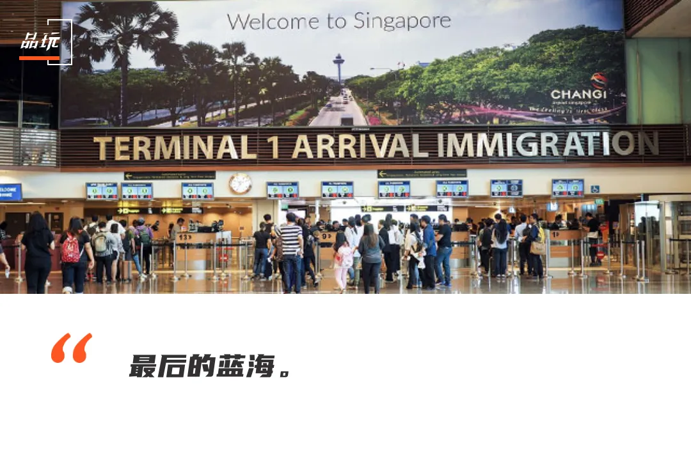
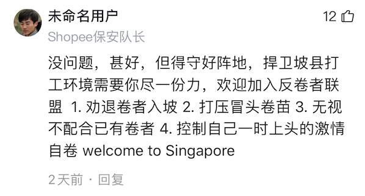

# title
深度｜中国互联网精英“卷”入新加坡

# author
沈丹阳

# publisher
品玩

# date
2021-06

# chapter
搜神

# tag
新加坡, 出海

# remarks
`想念`

这看起来是梦中才有的offer：

 1、美股上市互联网公司，市值是某大厂的两倍还多；
  2、薪资诱人，校招35万-100万总包，社招更高；
  3、告别996，工作早十晚七，无限量零食供应，18天年假，14天病假；
  4、拒绝内卷，无PUA，不强制绩效分布，新人不背锅，不设35岁门槛；
  5、此类岗位多多，均大量招人；欢迎有经验的大龄互联网人。

在一片“内卷”的中国互联网行业里，这样的描述看起来极度不真实。然而，事实却是，越来越多的人在接到这样的“邀约”。
是的，这些机会并不来自国内，也并非来自已有很多华人工程师的美国
——它们来自一个令中国互联网从业者既熟悉又陌生的国家：新加坡。

此前，红杉资本一位负责东南亚市场投资的投资人曾对品玩形容，若把整个东南亚比做整个美国市场，那么新加坡同时扮演了Menlo Park和Delaware的角色——前者代表了风险资本，后者则代表了税收优势。这使得新加坡成为拓展东南亚的一个最佳切入点。

“我们这批人没有经历过团购大战、单车大战，也没赶上最早的这波科技巨头的上市潮。虽然看起来高薪，但其实没有能实现跃升的机会了。”他说。
“对我们来说，新加坡就是最后的蓝海。”

