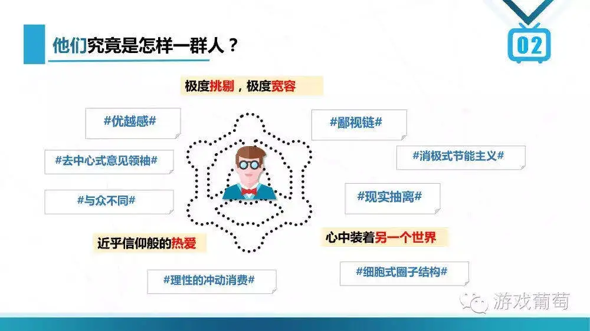

# title
二次元游戏的三大顽疾

# author
爱游戏的葡萄君

# publisher
游戏葡萄

# date
2020-05

# chapter
群像

# tag
游戏, 二次元

# remarks

> 为什么测试口碑都挺好，一上线就滑铁卢了？

> 为什么大部分游戏的卖点还是擦边，甚至直球？

> 为什么游戏题材越做越稀奇古怪，越做越小圈子化了？

> 那这二次元游戏是不是只能做成“色气美少女为反抗黑恶势力用十八般兵器拯救世界”的样子呢？

这反映出二次元用户的两面性和极端性，也折射出大家对待事物的判断取向：对错、是非、黑白的成分，远大于过程化和区间论的成分。

说人话就是，因为热爱，所以很多事情一定能实现，做到即真爱，做不到就是无爱，这是一种年轻人特有的判断方式。不同于上了年纪的人，他们的价值观里，很多结论都基于不同环境、时间、程度，最终只是个阶段性的结果，并无定论。

预期与实际的不对等，能引出的问题真的不少。

最容易被压垮的就是小团队，一张特别有feel的宣传图能引来大量用户的热捧，甚至能让团队误以为自己做了完全正确的选择，也能再做出同样正确的选择，直到产品做完，并顺势名利双收。

不过实际上最多的情况是，被吸引来的玩家一开始很热情，当团队拿出第一个测试版的时候，大家都激动不已只看好的一面，表示未来可期。当新的测试版本不断推出的时候，与玩家预期不符的东西开始变得越来越多，舆论的压力也会变大：“这不行，那得改，xx上了肯定死”。

最后上线前，团队已经改得焦头烂额，但好歹按照玩家的要求改得差不多了，结果一上线，或运营、或数值、或付费、或服务器……事故1、2、3的接连发生，还没来得及一个个补救，人走茶凉。回过头看当初的热度，恍如隔世。

满足用户预期是游戏的本职，海外某市场信奉这样一个运营准则：“发觉玩家内心的预期，并在接下来的运营中超出他们的预期，这是长线运营之道。”这指的不是在发福利让玩家白嫖这件事上超出预期，而是在玩家正向体验中寻找新的满足点。

我看到一款以这样的思路运作的手游，面对的是与国内完全相反的舆论环境，这款手游从不因为事故发补偿性质的福利，只在值得庆贺的日子发福利，为此官方会挖空心思找一个“能和玩家一起庆祝、一起开心的日子”发。

玩家看得出官方煞费苦心为自己好，知道这本不是人家的义务，也不是自己的权利。所以评论中透露的从来都是感谢、感动、感激，官方偶尔出错，致歉的公告下，也只有“别在意”、“累坏了吧？多休息”、“你已经很努力了”这类字眼。没有人质疑官方的动机，也不会有谁因为别人质疑出的动机，而对官方暴跳如雷。

这样的表现建立在一个良好的环境基础上：游戏与玩家的价值观高度一致，玩家明白价值交换需要对等，玩家会传递相同正向的价值观给新人，新人也会理解并认可这样的价值观，同时官方不会做任何违背这些价值观的举动。

所以一条长远上可行的路线是，官方尝试输出更多的价值观，一点点积累与用户的价值认同，并形成一个足够良好的舆情中枢，以此来辐射新进入的玩家。只不过，这种选择的代价太大了。
