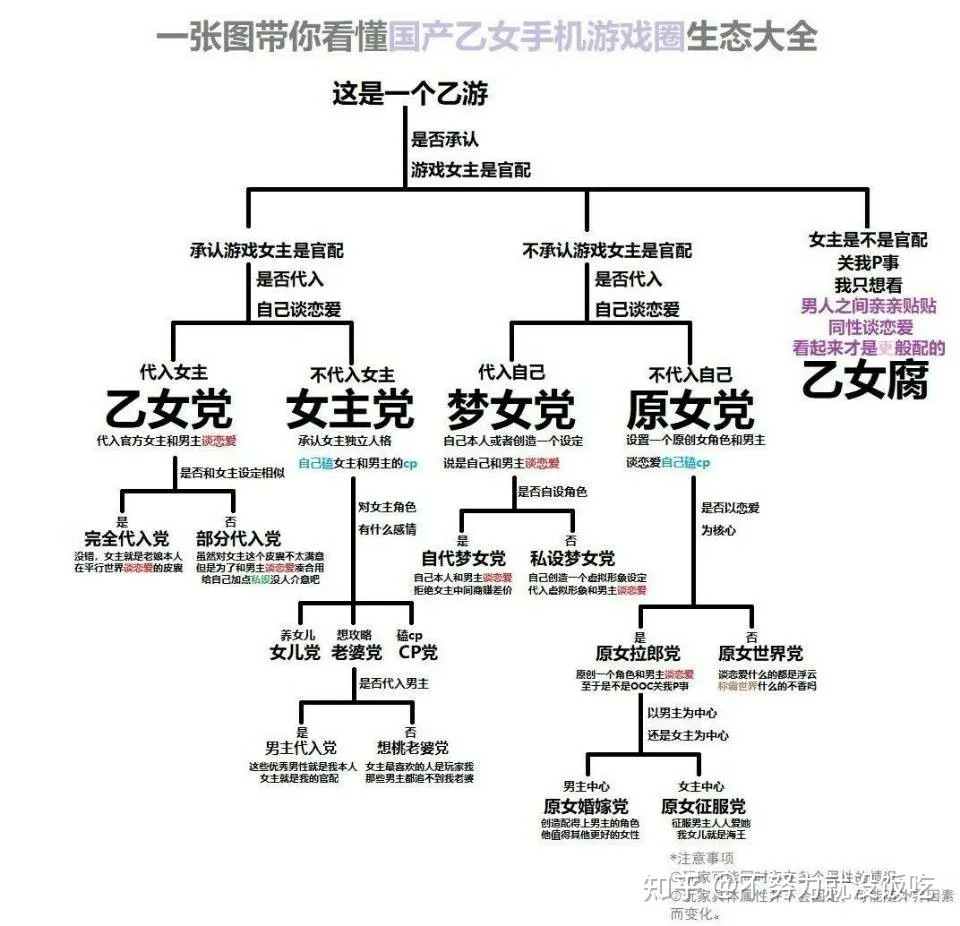

# title
“我是来借你的身体搞对象的，不是来供养女儿女婿的。”

# author
阿蒙

# publisher
BB姬

# date
2021-07

# chapter
游侠

# tag
游戏, 乙女

# remarks
`何其幸运. 做细分领域的王`

制作方最初也乐得享受这样玩家画像的存在，让他们不必再去费心游戏玩法。例如《光与夜之恋》，明明女主的设定是一名设计师，关卡战斗却是和设计毫无关系又究极简单的单点触控音游。

2021年，国产乙女手游步入百花齐放的“当打之年”，既有名门闺秀：来自腾讯的《光与夜之恋》，网易的《时空中的绘旅人》和米哈游的《未定事件簿》；也有小家碧玉，来自小厂的《少女的王座》和《掌门太忙》等等。

上述游戏虽然都在初期拥有着不错的流水，但没有一款能像当年的初代国乙王者《恋与制作人》一般独霸市场。

乙女玩家相比玩法更加注重文案、配音、剧情与卡面，就和格斗游戏玩家更注重手感一样无可厚非。但进入手游时代后，部分乙女玩家对游戏性的抛弃越发地明显，翻遍论坛都找不到几个讨论玩法的帖子，反而是内部群体的扯头花成为了主流矛盾。

其中最突出的两个对立群体是“女主党”和“代入党”。

说实话这个套娃也不算意料外的离谱，上面聊了那么多，大家也都清楚 ，乙女手游现在生态圈是确实诡异，但也确实可以说是官方逼疯了玩家。

解铃还须系铃人，要想改变乙女手游玩家生态圈的困局，也许还真的要等各官方什么时候能把游戏玩法捡回来，增添点剧情与养卡之外的乐趣，再认真思考下打榜之外的运营方法，官方才能真正站着把钱挣了，玩家也才能别再受苦。

不过玩家倒不必太费心于此，毕竟在如今这个乙游正火的年头，可选的男人实在是太多了。

