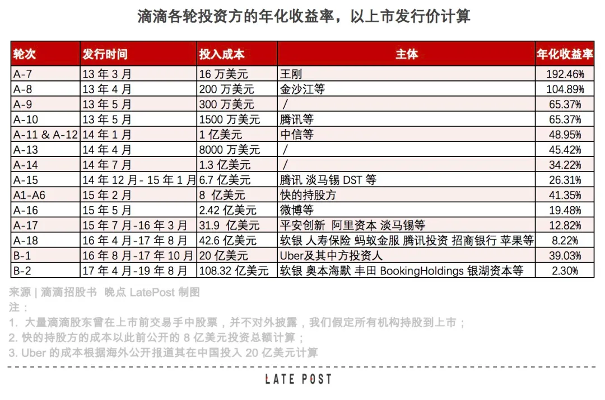

# title
滴滴，全球资本的超级工程如何成为资本的吞噬者

# author
晚点团队

# publisher
晚点LatePost

# date
2021-07

# chapter
列传

# tag
滴滴, O2O, 二级市场, 网约车, VC

# remarks
`网约车如此有价值; 滴滴不是收获者`

这样一个乏善可陈的上市结果，已经是这个科技巨头赶上 “最完美上市窗口” 的表现。

大公司并不一定得赶在股市高点上市。华为至今没有上市，每年也有超过 600 亿元人民币的净利润、给员工分红。年收入接近 2400 亿元人民币的字节跳动也搁置了境外上市计划，但它只要停掉几个新项目就能扭亏为盈。

但滴滴已经没有这样奢侈的选择。过去三年，滴滴经营亏损超 340 亿元。
