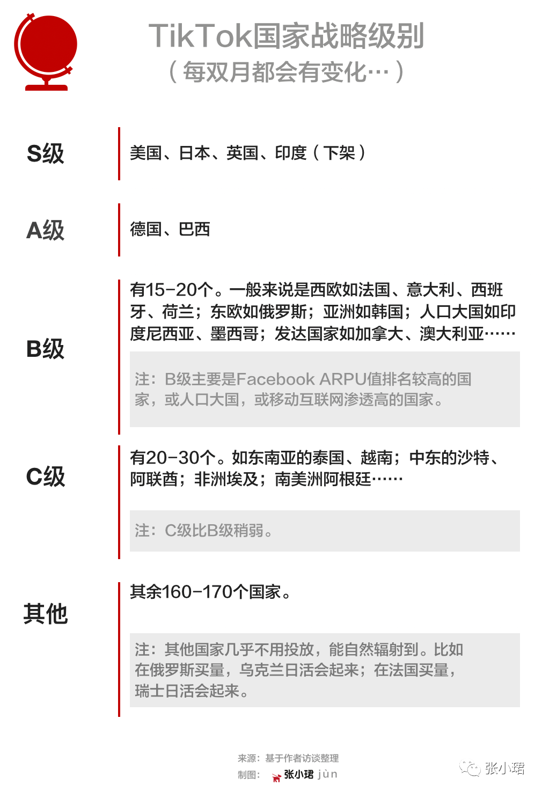

# title
​TikTok内幕：张一鸣的巨浪征途

# author
张珺

# publisher
张小珺

# date
2022-04

# chapter
世家

# tag
字节, TikTok, 出海

# remarks
`移动互联网最后一场大仗了吧`

软件工程师背景的张一鸣，身高不足1米7，眼睛细小，戴眼镜，逢人笑眯眯的；说起话有点囫囵吞枣。很多人奉他为数据导向、机器理性的代言人。这种说法体现了技术主义的纯粹路线，却忽视了他为人处事的一面。他性格温文尔雅，看上去是个真诚、单纯、无害的人。但他有一种纯粹人格体现出的高情商。对他熟悉的人告诉我，张一鸣擅长理解人性，能迅速传递善意并让对方觉察到。“接触过他的人，往往会觉得这小伙子不错，很愿意帮他。”

在更早前的2014年，今日头条面临公关危机。张一鸣登门和媒体沟通。一位接近该风波的人士对我回忆，德高望重的老牌媒体人，见到饱受争议的科技新秀，怒意正盛，但交谈至后半程，情节出现不可思议的反转——对方竟开始站在他的立场上为他考虑。

另一方面，张一鸣不会感情用事，对人对事极为精确，眼睛容不下灰色和沙粒。这让他流露出一种狠绝。在早期，他把拿走公司代码的人送进了监狱。

---

`持续的失败和挫折, 战略定力`

2017年，由于缺乏新的性感故事，字节在焦虑中度过。7月，战略部撰写报告，呈交到张一鸣面前。报告显示，资讯产品国际化希望渺茫，亟需转型。但张一鸣接受不了退缩——“一鸣笃信大力出奇迹。”国际化事业部员工说，在他心里，这个模式既然在中国验证，就应当能走向全球。项目又坚持一年。

另一方面，刘新华认为图文大势已去，兴致变得寥寥，将精力转移到视频上。据接近高层的人士说，刘到日本发现，日本资讯有强悍产品，机会微乎其微，于是放弃图文，只做Buzz Video，早期迎来不错的增长。小视频让他尝到甜头。然而，事业部这种独立王国的弊端愈发凸显，从中台抽调资源难度大。而刘想做视频，不符合张一鸣对他的预期，且视频赛道在字节有人镇守。于是，在文化融入和产品方向的多重诱因下，刘在任仅一年就离开，加盟快手。

在2018年的项目讨论会上，大人物们围绕一张方桌坐下，中层环绕坐在他们身后。平日里，掌握钞票源头的张利东说话很有分量。他曾是一名记者，位至《京华时报》副总裁。他比张一鸣更感性，但是判断老辣、杀伐果决。与会人士对我转述说，那天，张利东操着沙哑的嗓音，突然说话了：“这个项目不做了，又挣不到钱……”

顿时，满屋子鸦雀无声，没有人敢发言。

“这个项目还是有前途的，咱们还可以再看一看。”张一鸣接过了话头。

刘新华走后，国际化事业部就四零五落了。产品、运营分别由彼时头条对应的负责人陈林和赵添接管，算法、技术汇报回各自中台。再后来，康泽宇从百度加盟字节，接手了国际化产品。他在这里孵化了印度社交产品Helo。

软件工程师背景的张一鸣，身高不足1米7，眼睛细小，戴眼镜，逢人笑眯眯的；说起话有点囫囵吞枣。很多人奉他为数据导向、机器理性的代言人。这种说法体现了技术主义的纯粹路线，却忽视了他为人处事的一面。他性格温文尔雅，看上去是个真诚、单纯、无害的人。但他有一种纯粹人格体现出的高情商。对他熟悉的人告诉我，张一鸣擅长理解人性，能迅速传递善意并让对方觉察到。“接触过他的人，往往会觉得这小伙子不错，很愿意帮他。”

在更早前的2014年，今日头条面临公关危机。张一鸣登门和媒体沟通。一位接近该风波的人士对我回忆，德高望重的老牌媒体人，见到饱受争议的科技新秀，怒意正盛，但交谈至后半程，情节出现不可思议的反转——对方竟开始站在他的立场上为他考虑。

另一方面，张一鸣不会感情用事，对人对事极为精确，眼睛容不下灰色和沙粒。这让他流露出一种狠绝。在早期，他把拿走公司代码的人送进了监狱。

---

2017年，由于缺乏新的性感故事，字节在焦虑中度过。7月，战略部撰写报告，呈交到张一鸣面前。报告显示，资讯产品国际化希望渺茫，亟需转型。但张一鸣接受不了退缩——“一鸣笃信大力出奇迹。”国际化事业部员工说，在他心里，这个模式既然在中国验证，就应当能走向全球。项目又坚持一年。

另一方面，刘新华认为图文大势已去，兴致变得寥寥，将精力转移到视频上。据接近高层的人士说，刘到日本发现，日本资讯有强悍产品，机会微乎其微，于是放弃图文，只做Buzz Video，早期迎来不错的增长。小视频让他尝到甜头。然而，事业部这种独立王国的弊端愈发凸显，从中台抽调资源难度大。而刘想做视频，不符合张一鸣对他的预期，且视频赛道在字节有人镇守。于是，在文化融入和产品方向的多重诱因下，刘在任仅一年就离开，加盟快手。

在2018年的项目讨论会上，大人物们围绕一张方桌坐下，中层环绕坐在他们身后。平日里，掌握钞票源头的张利东说话很有分量。他曾是一名记者，位至《京华时报》副总裁。他比张一鸣更感性，但是判断老辣、杀伐果决。与会人士对我转述说，那天，张利东操着沙哑的嗓音，突然说话了：“这个项目不做了，又挣不到钱……”

顿时，满屋子鸦雀无声，没有人敢发言。

“这个项目还是有前途的，咱们还可以再看一看。”张一鸣接过了话头。

刘新华走后，国际化事业部就四零五落了。产品、运营分别由彼时头条对应的负责人陈林和赵添接管，算法、技术汇报回各自中台。再后来，康泽宇从百度加盟字节，接手了国际化产品。他在这里孵化了印度社交产品Helo。

---

整合有些细节举措。“黑T”和“白T”没有合并产品包。他们把Musical.ly图标统一换成TikTok，角标保留Musical.ly标识；并将标题改为：TikTok-including Musical.ly。换档持续大半年，品牌心智建立后，才拿掉了“including Musical.ly”字段。只是后来发现，“白T”表现整体优于“黑T”，因而他们把所有应用都替换成了“白T”的产品包。这也表明，如今我们看见的新TikTok，是字节算法和Musical.ly产品包合并演化而来，各取所长。

接下来，一场绚丽的金钱狂欢登场了。以砸钱为驱动的商战，在中国惨烈的互联网江湖早已司空见惯，更何况发起者是惯于搅动风云的字节跳动，就更不足为奇。只是这次，他们将烧钱战火引向海外。充满戏剧的是，在一段时间内，Facebook不但没有阻挠TikTok，还将后者视为最尊贵的客户。

整合完毕后的TikTok一声令下，进入撒钱、撒钱、疯狂撒钱的狂热中。他们最重要的投放渠道当然是老冤家Facebook。“2018年三、四季度到2019年一季度，TikTok推广预算每个季度100%以上的增长，”一位接近Facebook的人士对我说，“Facebook大中华地区一年营收大概50亿美金，TikTok当时计划三年贡献10亿美金左右。”

整个产业链都被卷进这场金钱舞曲中。负责Facebook亚太的销售是一名中国人，得益于TikTok，他当年荣耀加身，成为全球销售冠军。2018年底，公司为他发放了超额年终奖，“可能百万级别”。“新加坡和香港同事都在说，他踩了狗屎运。”——此时此刻，Facebook没有提起警惕。

`这段说的是什么屁话, 记者没搞懂. 实际应该就是养内容养算法吧`

让Facebook放松戒备的原因很简单：TikTok留存率实在太差。“这个公司是不是傻？买的用户基本都跑了，次日留存率30%。Facebook内部的看法是：我把流量导给它，它反正也留不住用户，不构成什么威胁。”上述人士说。2019年初，字节彼时负责国际化职能部门的高级副总裁柳甄，专程带团队到Facebook，和其大中华区高层签署了年度战略合作协议。

事实上，在Facebook买量性价比极低，此时在美国购买一个用户，金额夸张到约10美元。但是，字节跳动这家长于算账的企业，默默地升级了策略。接近字节的人士告诉我，他们不再纠结多久能挣回成本，而是转为观察ARPU值。简单来说，就是一个日活用户可以赚多少钱。

商战的狡猾就在于此。字节制定目标并非凭空设计，他们死死瞄准Facebook。字节花高薪从Facebook挖来一批管理层，其中有人把Facebook数据带了出来。数字的颗粒度精细，有些没有在财报披露过。比如，Facebook在每个国家日活多少、能赚多少钱……字节依此制作了一张涵盖100多个国家的精美表格。随后，他们巧妙地以Facebook ARPU值作为目标，倒推需要花多少钱做投放。

令Facebook大意的是，与社交不一样，视频内容能跨国界。一条美国的短视频，欧洲、日本、拉美都可以消费，天生坐拥扩展性。而且，这个产品实在太顺人性，又为其施加了一层魔法。再加上全球性产品有迷惑效应，单看各国数据不出众，而字节采取分散瓦解、逐个击破的战术，最终把100多个国家汇聚起来能一鸣惊人。

---

朱骏的就位恰逢其时。他坐上驾驶位，在这艘全球化舰队上凝聚了人心、稳定了军心，带领所有人一同驶入黑夜。2020年初，TikTok日活不到2.5亿。船中人此时浑然不觉，前方一场巨大暴风雨正在酝酿。

新冠病毒迅速流窜开——全球疫情大爆发了，TikTok也大爆发了。

先是2月底，一则海外访谈在字节高层群里炸了锅。Facebook COO 雪莉·桑德伯格接受采访说，TikTok增速令她忧心，“增长数字比我们以往任何时候都快”。TikTok感受到的不是喜悦，而是惶恐万分。朱骏召集紧急会议：“桑德伯格已经关注我们了。”

此时，张一鸣的双月OKR有一行写着“不留空档”。接近权力的人士告诉我，它实则是一句暗号，全称是：“不留空档、全面压制。”这八个大字是这位少言寡语、外表没有攻击性的老板，向TikTok下达的最高指令。

在八字方针下，TikTok有两条不成文的约定：不管哪个地区，只要竞争对手去了，TikTok必须挺进将其碾压；但凡榜单出现竞品排名超前，必须在一个星期内，无论以什么价格把对方击溃。哪怕“杀敌一千、自损八百”，只要立于不败之地，任何代价都在所不惜。

用户增长（UG，User Growth）中台是承接最高指令的排头兵，负责人名叫赵祺。他是北大计算机博士，长得文质彬彬、戴黑框眼镜，曾是创业公司“车来了”的联席CEO。对他个人而言，这是段不算成功的创业。但大公司就是这么奇怪——有时格外偏袒有创业经历，哪怕是失败创业经历的人来独当一面。或许出于他们身上的悲壮色彩，或者是统管大局的魄力，又或者只是人在见识过商业谷底后，吐露的句句真挚话语，总让CEO感到同病相怜、心心相惜。

“所有人都惊呆了，”上述员工总结称，“TikTok和快手、Likee最大区别是，就占领发达国家。它有一个公共池子，美国内容供应全球，抖音内容供给东亚、东南亚。威力特别大。”

相比之下，快手国际化绕了不少弯路。原快手员工说，他们曾采用所谓“赛马机制”，在各地区换了光怪陆离的名称——Kwai、Snack Video、Zynn（已关闭）。这些小团队如同春笋四处生根，独立作战。负责人走马灯似的换，刚宣布离任的负责人仇广宇（Tony）来自滴滴，是第五波团队了。

`DAU渗透率到一定之后, 都是自然量`

第一阶段是无脑砸资源。抖音验证了这个商业故事的非凡，在全球不过是复制，所谓“简单相信、傻傻坚持”。

第二阶段是内容生态建设。运营人员把YouTube、Instagram、Pinterest等网红全挖一遍。如果竞争对手花1万，TikTok就砸2万。机器两端是用户和内容。用户增长端源源不断输送用户，内容端源源不断输送达人，两边产生化学反应，用户体验螺旋式上升。

第三阶段就是里程碑时刻——拐点降临了。字节有个“拐点理论”，会额外重视“DAU渗透率”（日活渗透率）。日活渗透越高，用户粘性就越高，先前困扰TikTok、也令Facebook误判的留存率，会水到渠成地提升起来。据经验，各国渗透率抵达20%-30%，能迎接拐点。

拐点是神奇的时刻。一待降临，App流行主要靠人际传播、自然增长。“买量：自然量”从买量占大头，过渡到自然量占大头，数字一格一格向后挪动。全球来看，买量开始占比七八成，现在降到两三成，“形成了自然、健康的增长状态”。

印度尼西亚原归属b，一段时间直通至a，源于东南亚人表达欲旺盛。TikTok发布率在印尼高达10%，相比抖音在国内不及5%，日本只有2%-3%。“东亚人更内敛。”一位负责国家策略的人员说。

韩国开始隶属a，但因日活增长乏力掉到c，一段时间又提至b。有员工判断，或许与“韩国人比较排外”有关。“你看韩国85%的市场份额是三星和LG，不用中国的，也不用苹果。”另一重因素是“韩国的娱乐选项实在太多”。

---

事发几天内，梅耶尔召集all-hands meeting（全员会），这成为字节有史以来最仓促的一次全体会议。在只有不到五分钟的时长里，梅耶尔告诉大家，不要担心，印度团队正在积极沟通，局面尚未可控。但是，他食言了。

颇具喜感的是，印度排名第二的短视频App是快手旗下Snack Video，随着TikTok遭封禁，它的数据迎来迅猛爬升，日活冲过1.5亿大关；但窃喜没持续多久，五个月后它也在印度被封了。

回到TikTok美国这边，危急的形势急转直下——2020年7月，美国政府高层表态将封禁TikTok；8月，特朗普下达45天通牒，命TikTok剥离美国业务，否则关门。张一鸣被迫就出售进行谈判，潜在交易对象包括微软、甲骨文、沃尔玛等商业巨头，以及字节的美国投资方。张一鸣表面上参与分拆谈判，但暗中秉持全球一盘棋的信念。

上任不到三个月，梅耶尔突然宣布离任。公司内众说纷纭，有人说，他的算盘是联合股东出售TikTok在美板块，这似乎符合他的个人利益；也有人说，他没有那么大的能力，单纯是“被吓到了”。TikTok北美总经理瓦妮莎·帕帕斯（Vanessa Pappas）成为过渡CEO。

扑朔迷离的美国风波，最终缓解于特朗普的竞选失利。“这有点像什么呢？我趴那儿不动，感觉他们会‘死’，他们就真的‘死’了。”一位密切关注此次事件的业界资深人士说，稍有一步差池，字节在美资产血本无归。张一鸣因为谈判客观上延长了时间，熬过美国大选。美国新任总统拜登上台后，撤销了封禁令，字节因而避免灾难。

他认为此次事件，要比字节以前在国内“躲过巨头的追杀”艰难得多。它曾游刃于巨头间，和巨头谈恋爱，但没倒向任何一方阵营，练就了“左右逢源”的本领。而在TikTok事件里，字节面临的局面更为被动，博弈对象也更为庞大，“它就像大海里的一叶浮萍”。该人士以车开进北京狭窄的胡同作比，令所有人没有料到：“它穿过一次，这次开进去，又出来了。”

各国政府对数据安全管控不一。为了不再度以身涉险，字节设置了异常严格的隔离机制。据对此了解的法律方面人士说，针对个人账号、住址、社保卡、消费记录这类敏感数据，大原则是“中国的数据在中国，海外的数据在海外”。在美国、欧洲、新加坡等，TikTok设有数据中心。全球不同地的数据流入哪个数据中心，会先依据法律，再根据就近原则。譬如在事态特殊的美国，即使其他数据中心在地理上更占优，数据也不会流出美国边境。

“这是个庞大工程。”一位接近字节高层的人士说，公司花费很大资金完善这件事，从各个层面隔离数据，进行数据加密，设计高复杂度验证机制，使不同权限的人“既能支持工作，又不能看数据”。

字节也成为本地化最彻底的中国科技企业。“中国没有一个互联网公司能这么依靠local。”有员工说道。就连依赖总部的中台也要本地化，如掌握了增长钥匙的用户增长中台，在海外其实很难招。但美国、英国、日本、巴西、德国都设有增长策略团队。有些市场在一段时间还让两边团队PK。

这么做的目的不是竞争，而是以竞赛替代训练，让中国人帮本地人成长。最痛心的就在于此。中国团队做大市场、积累方法论，然后他们亲自上场招聘本土团队，将技能传授出去。明明知道结果是“乱拳打死老师傅”。“我们每天都担心是不是要降临到自己的头上，”一位亲历者称，“但属于慢慢渗透。”

中国员工抱怨道：“他们工作勤奋度远远比不上中国人，普遍是965（9点上班、6点下班、工作5天）。”“当地人不做的事我们做，他们闯了祸，我们要擦屁股。”而且现在是，“TikTok基本不在国内招人，国外招不到的才在国内招”。

全球化挤压了中国人的工作机会。声势浩大的“本地化”造成了，一位中国公民要想在字节国际化的大船之上，大概有三种选择。一是变更常驻地到新加坡、洛杉矶等，这样可访问当地数据；二是拿美国绿卡，通过VPN访问当地数据，但有权限限制；三是从接触数据的核心部门腾挪至不必依赖数据的地带，相对离开决策中心。

经历了政治大冒险，虽然知道本地化是正确道路，也是必经之路，但他们依然是这艘舰队上的伤心之人。不久，伤心之人就下船了。

---

脚本永远是：在新加坡上学、参军，到英国念大学；一次机会和声名显赫的俄罗斯老板Yuri Milner结识，在DST工作的五年中，投资了小米、滴滴、阿里等中国公司；然后收到哈佛商学院offer，不顾Yuri挽留重返校园，Yuri在这期间投了令人垂涎的大单子，他表达了羡慕和惋惜。“有点凡尔赛，但不让人讨厌。”当然，他重点说到，自己如何见到张一鸣。演讲还掺杂了一丁点遇见人生伴侣的私人桥段，拉升好感。

在舰队金字塔上，周受资雄踞于顶。作为总舵手，他麾下有最重要的两员将领：一个是中国人朱文佳，一个是美国人帕帕斯。朱文佳主导产研，帕帕斯主管区域总经理（GM，General Manager），后者精力花在本地化运营上。

---

`Baby you're a rich man too`

在高速度完成全球化的大扩张后，张一鸣已经卸任CEO，于2021年底退居二线。字节跳动现任CEO梁汝波，从大学宿舍就跟随张一鸣创业，是一个比张一鸣更谦虚、内敛、低调的联合创始人。有内部人士提醒我注意，梁汝波是技术背景，这有利于字节跳动全球品牌形象。他的英文进步大，已经和外国人对答如流。而且，口音要比张一鸣小不少。

最后，将时光退回到十二年前，此时张一鸣和梁汝波刚创办上一家公司九九房，2010年是公司的第二个年头。这年圣诞节，张一鸣看了影响一代移动互联网创业者的电影——扎克伯格传记片《社交网络》。年少成名的社交网络创始人，和张一鸣一样是80后，扎克伯格甚至比张一鸣小1岁。

看完电影，张一鸣点开豆瓣App，敲下一句简短的评论：“《The Social Network》印象最深的词是偏执。”他给了这部电影四星推荐。

一年零三个月后，张一鸣创立字节跳动。往后的很多年，Facebook一直埋在他的心底。不过现在，他不再那么频繁地提起这家公司了。

诚如张一鸣率领TikTok逆浪出征，在这个世界，假如你不被欲望吞噬，或许你就能一口吞噬欲望。
